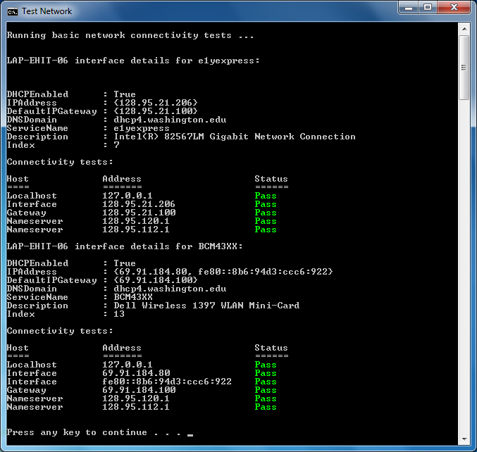

# test-net
A powershell script to test network connectivity on a Windows computer.

* Place the contents of this repository in a folder on your Windows computer.
* Double-click the file named "test-net.bat" to run the script.
 

